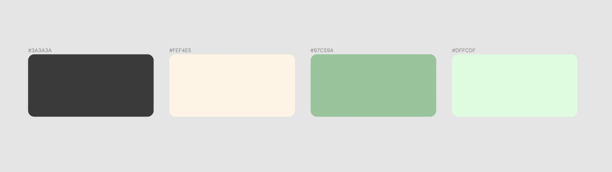

Hello, world! My README.md is coming soon.

[View the live project here →](https://github.com/elainebroche-dev/ms1-thrive/)

Amyloidosis.ie is for amyloidosis patients to find and share information on the disease across Ireland. Amyloidosis (am-uh-loi-DO-sis) is a rare disease that occurs when an abnormal protein, called amyloid, builds up in your organs and interferes with their normal function.

# Index 

# User experience (UX)

## User stories

As a **first time visitor** I want to easily;

- understand the main purpose and learn more about the site's mission
- navigate and find relevant content
- navigate to share my own story with amyloidosis.

As a **returning visitor** I want to easily;

- have familiarty in design remain since the last visit
- check for the latest amyloidosis research
- be able to share updates to my own amyloidosis story

# Features

## Existing features

### 1. Navigation bar

The navigation bar has a stable and consistent look on all pages. It includes a simple text logo, Home page, Research library page, and a submission page for users own amyloidosis stories.

### 2. Landing page image

A wholesome Donegal landscape to help put the users mind at ease. It's a moment of pause, without images or text or a call to action. 

### 3. Disease summary

The disease definition and it's different types are listed in a three column layout.

### 4. Footer

The footer is identical across each page. It houses the social media contact icons and a medical disclaimer. This is particularly important when the site is dealing with the subject of healthcare of our users.

### 5. Research page header & filter

The research page collates information about the disease from multiple sources. The header includes a filter which anchor links to the relevant articles. This aids navigation. The filter types are:

- Personal story
- Academic paper 
- News article

### 6. Article sections

Each collated piece of research is either; 

- A blog post hosted on our own site [amy.ie](https://amy.ie)

or

- A section that links to an external source, without being hosted on our site. 

### 7. Story submission form

Sharing user stories will help personalise the disease and make any patient feel less alone. The form maintains a simplicity that focuses on the least information necessary.

It's only necessary to include their first name and email address.

## Future potential features

- 

# Design language

### Typography

- Since the majority of users are expected to be elderly (the disease only appears in later life) I have opted for legibility with typesetting. 

- I tested lots of font pairings to finally settle on DM Sans for the headings and Inter for the body.

- They have a simplicity and a slightly larger than what I might normally design, for better accessibility.

### Colors

- Minimal colours help focus the user on the important elements on the page. I opted for a simple complimentary set of greens, a soft cream to give the footer some foundation, and crucially a softer grey -rather than total black. 

