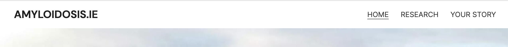
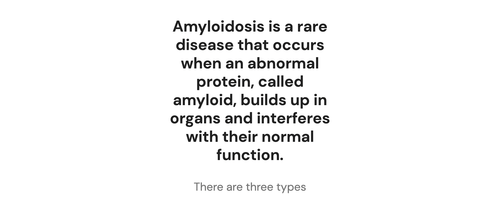
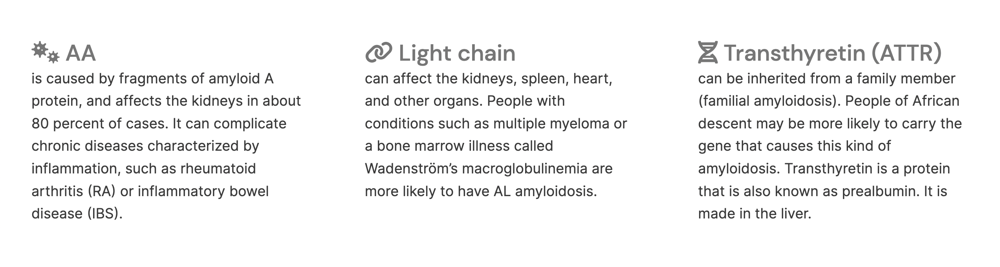
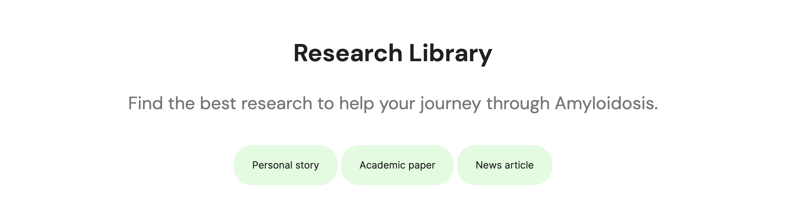
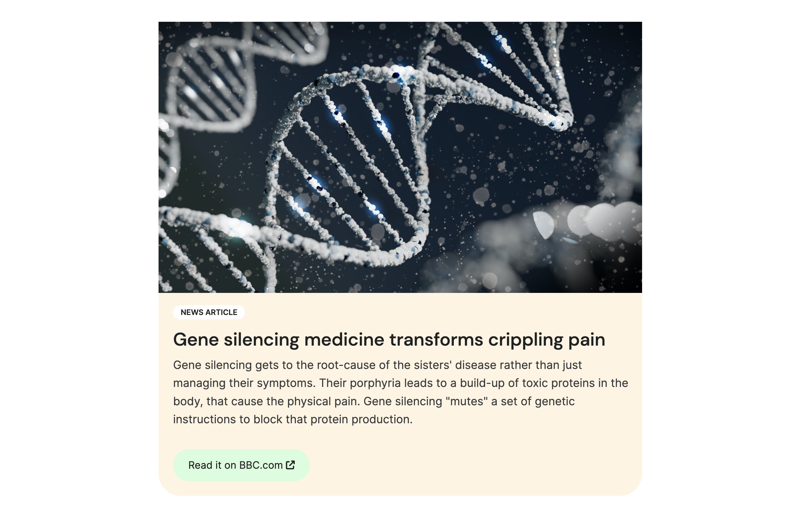
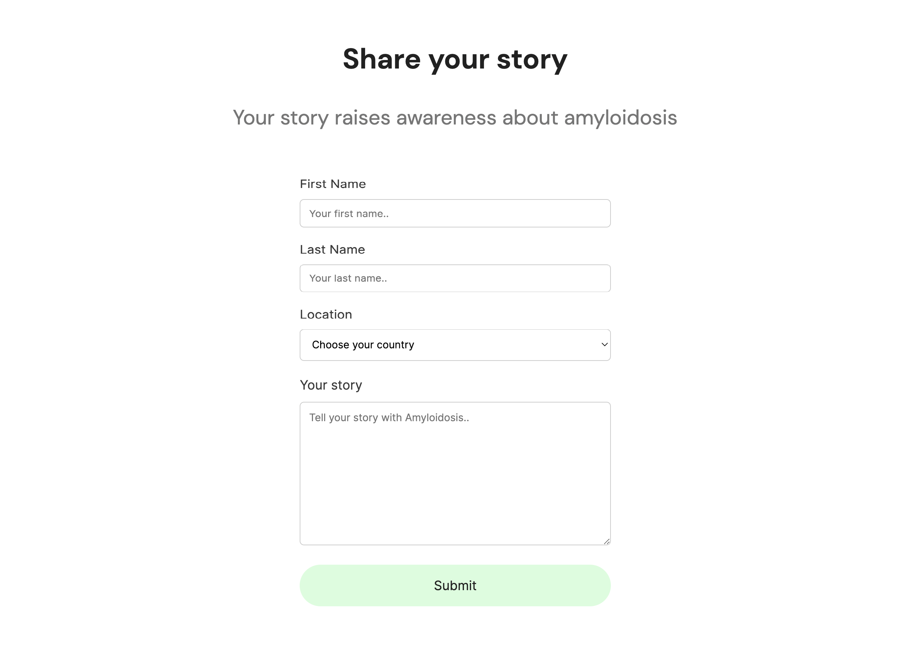
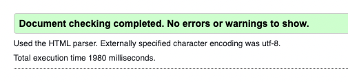
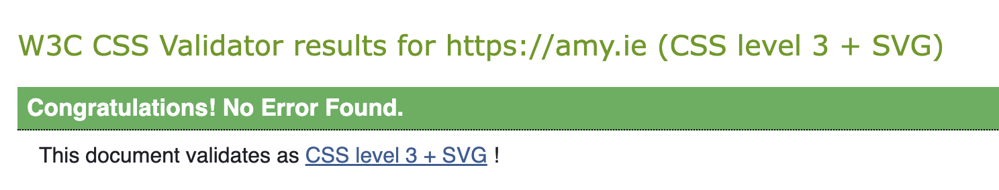

# Amy.ie  | Amyloidosis Ireland
[View the live project here →](https://github.com/elainebroche-dev/ms1-thrive/)
 
***
 
### Amy.ie is for amyloidosis patients to find and share information on the disease across Ireland.
 
This is a "real-life" project that's aiming to solve a real world problem.
 
I'm working with a group of Amyloidosis patients in Ireland who are campaigning for better treatment, going through medical trials for gene silencing treatment and overall raising awareness of the disease.
 
I became aware of the disease last year after my uncle's diagnosis.
 
Amyloidosis (am-uh-loi-DO-sis) is a rare disease that occurs when an abnormal protein, called amyloid, builds up in your organs and interferes with their normal function.
 
 
# Index
 
 
- [User experience](#user-experience-ux)
- [Features](#features)
- [Design language](#design-language)
- [Technologies](#technologies)
- [Testing](#testing)
- [Deployment](#deployment)
- [Credits](#credits)
 
 
# User experience (UX)
 
## User stories
 
As a **first time visitor** I want to easily;
 
- understand the main purpose and learn more about the site's mission
- navigate and find relevant content
- navigate to share my own story with amyloidosis.
 
As a **returning visitor** I want to easily;
 
- have familiarity in design remain since the last visit
- check for the latest amyloidosis research
- be able to share updates to my own amyloidosis story
 
 
# Features
 
## Existing features
 
### 1. Navigation bar
 
- The navigation bar has a stable and consistent look on all pages. It includes a simple text logo, Home page, Research library page, and a submission page for users' own amyloidosis stories.

 
### 2. Landing page image
 
- A wholesome Donegal landscape to help put the user's mind at ease. It's a moment of pause, without images or text or a call to action.

 
### 3. Disease summary
 
- The disease definition and its different types are listed in a three column layout.

 
### 4. Footer
 
- The footer is identical across each page. It houses the social media contact icons and a medical disclaimer. This is particularly important when the site is dealing with the subject of healthcare of our users.

 
### 5. Research page header & filter
 
- The research page collates information about the disease from multiple sources. The header includes a filter which anchors links to the relevant articles. This aids navigation. The filter types are:
 
    - Personal story
    - Academic paper
    - News article

### 6. Article sections
 
- Each collated piece of research is either;

    - A blog post hosted on our own site [amy.ie](https://amy.ie)
    OR
    - A section that links to an external source, without being hosted on our site.

### 7. Story submission form
 
Sharing user stories will help personalise the disease and make any patient feel less alone. The form maintains a simplicity that focuses on the least information necessary.
 
It's only necessary to include their first name and location.

## Future features
 
- Filter by research type using Javascript
- Community forum for users to post topics and message each other
 
# Design language
 
### Typography
 
Since the majority of users are expected to be elderly (the disease only appears in later life) I have opted for legibility with typesetting. I tested lots of font pairings to find a simplicity and legibility to ultimately decide on:
 
- Headings: [DM Sans](https://fonts.google.com/specimen/DM+Sans)
 

 
 
- Body: [Inter](https://fonts.google.com/specimen/Inter)
- Blockquotes: [Crimson Pro](https://fonts.google.com/specimen/Crimson+Pro)
 
 

 
 
### Colours
 
- Minimal colours help focus the user on the important elements on the page. I opted for a simple complementary set of greens, a soft cream to give the footer some foundation, and a softer grey — rather than total black - for type.
 

 
### Favicon
 
- Minimal design of favicon using the DNA emoji with support for all browsers, including Apple Touch and Android app icons.
 

 
# Technologies
 
### Languages used
- HTML5
- CSS3
 
### Additional frameworks, libraries and apps used
 
- [Google Fonts](https://fonts.google.com/) to import fonts..
- [Font Awesome](https://fontawesome.com/) add icons.
- [Git](https://git-scm.com/) for version control using the VSCode Terminal to commit to Git and push to Github.
- [Github](https://github.com/) where the repository is hosted.
- [VSCode](https://code.visualstudio.com/), to write and edit code.
- [Figma](https://figma.com/) to draw quick mockups (iPad app) and layout the design language.
- [Vercel](https://vercel.com/) to host the project and provision a custom domain name.
 
# Testing
 
### Validator testing
 
- For https://amy.ie/index.html the HTML validator result is:
 

- The CSS validator complete without issues:

 
- Warnings on other pages such as `"Section lacks heading. Consider using h2-h6 elements to add identifying headings to all sections"` I have allowed to remain, since with research I discovered that the `<section>` definition states:
 
> "The theme of each section _should_ be identified, typically by including a heading (h1-h6 element) as a child of the section element." _(Emphasis mine)_ [[Source]](https://www.w3.org/TR/2014/PR-html5-20140916/sections.html#the-section-element)
 
- Since it's _should_ and not _must_ I am going to accept this as a warning — not an error — and proceed.
 
 
### Browser compatibility
 
- Chrome Version 99.0.4844.84 ✅
- Safari Version 15.4 ✅
- Firefox 98.0.2 ✅
 
### Known bugs
 
- None known
 
# Deployment
 
### How this site was deployed
 
- From the Github repository, I set up Github pages from the `main` branch.
 
- In addition, since the project is solving a "real-life" need I have deployed via [Vercel](https://vercel.com) too. It offers an abstracted backend of hosting and edge routing, all free for hobby projects.
 
- In Vercel, I have connected this repository, set it to the `main` branch therefore each push from VS Code is now deploying into production. I can deploy to preview links using branches too, though that's for the future.
 
# Credits
 
### Content
 
- Research article content:
 
   - `Personal story` is based on this article [here](https://my.clevelandclinic.org/patient-stories/324-amyloidosis-patient-credits-faith-and-family-for-survival).
 
   - `News articles` are credited on the site before hyperlinks go out to the original source — [BBC](https://www.bbc.com/news/health-58988006) and [Nature.com](https://www.nature.com/articles/s41408-021-00486-4).
 
### Code
 
- I learned about Flexbox from [w3schools](https://www.w3schools.com/css/css3_flexbox.asp) and [MDN Web Docs](https://developer.mozilla.org/en-US/docs/Web/CSS/CSS_Flexible_Box_Layout/Basic_Concepts_of_Flexbox)
 
- I learned how to add a default selection option in a form dropdown field on [Stack Overflow](https://stackoverflow.com/questions/8605516/default-select-option-as-blank)
 
- I learned how to add Favicons and generate them with [Favicon.io](https://favicon.io/) and the [MDN Web Docs](https://developer.mozilla.org/en-US/docs/Glossary/Favicon) to clarify best practice for hosting them in the root directory.
 
### Media
 
- Icons are from [Font Awesome](https://fontawesome.com)
 
- Fonts are imported from [Google Fonts](https://fonts.google.com)
 
- Favicon images are licensed under [CC-BY 4.0](https://favicon.io/emoji-favicons/dna).
 
### Images
 
- [Photo](https://unsplash.com/photos/K4EFDhu0oxw) by Tommy Kwak on Unsplash
 
- [Photo](https://www.pexels.com/photo/man-people-woman-young-8460233/) by Los Muertos Crew on Pexels
 
- [Photo](https://www.pexels.com/photo/man-love-people-woman-8460223/) by Los Muertos Crew on Pexels
 
- [Photo](https://unsplash.com/photos/Iy7QyzOs1bo) by Sangharsh Lohakare on Unsplash
 
- [Photo](https://www.pexels.com/photo/doctor-sitting-in-front-of-his-desk-2182979/) by LinkedIn Sales Navigator on Pexels
 
### Acknowledgments
 
- Huge thanks to my mentor Brian Macharia, who offered sage advice on how to plan well, mental models, and resources on better ways to approach coding.

